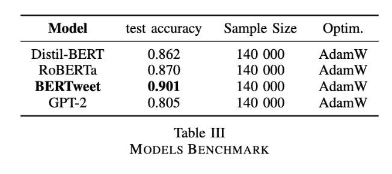
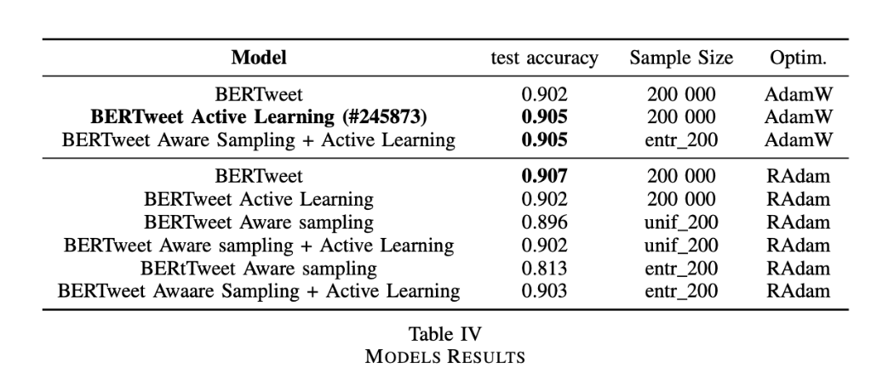

# Harnessing the Potential of Pretrained Language Models and Active Learning for Tweets Sentiment Analysis

>**Authors**:
> - Marc-Antoine ALLARD (marc-antoine.allard@epfl.ch)
> - Antoine MAGRON (antoine.magron@epfl.ch)
> - Paul TEILETCHE (paul.teiletche@epfl.ch)
>
> Repository of APMA-AI team's report for CS-433 project 2.

## **Main Results**



## **Using our codebase**
#### Available Pre-Trained Models
This codebase is built to be compatible with any [HuggingFace](https://huggingface.co/) listed model. You can look for available models on their [models page](https://huggingface.co/models).

#### Experiments
- **Requirements**:
Here are the requirements to use our code:
    ```bash
    # Hugging Face
    pip install transformers
    pip install datasets
    pip install evaluate
    pip install emojis
    pip install accelerate

    # Torch
    pip install torch

    # General purpose
    pip install pandas
    pip install numpy
    ```

- **Experiment Arguments:**
You are free to set any of these arguments for your experiment:
    1) *Model & Data Arguments*
    - `BASE_MODEL`: Base model used for training.
    - `N`: Number of instances in the dataset.
    - `test_ratio`: Ratio of the dataset used for testing.

    2) *Training Arguments*
    - `epochs`: Number of training epochs.
    - `optimizer`: The training optimizer.
    - `bs`: Batch size used during training.
    - `lr`: Learning rate for the training process.
    - `wd`: Weight decay parameter.
    - `warm_pct`: Ratio of steps used to warmup the optimizer

    3) *Active Learning Arguments*
    - `active_learning`: Boolean indicating whether active learning is enabled.
    - `T`: A parameter related to active learning.
    - `aware_sampling`: Boolean indicating whether aware sampling is enabled.
    - `aware_sampling_type`: Type of aware sampling.

    4) *Global Arguments*
    - `SAVE_DIR`: Directory for saving the model and related files.
    - `DATA_PATH`: Path to the dataset.
    - `seed`: Random seed for reproducibility.
    - `device`: Device used for training (e.g., "cuda:0" for GPU).


- **Launch An Experiment**:
Our code is really simple to use. 

    1) Specify your arguments in the **Parameters** section. Here is an example of use.
        ```python
        # This launch an experiment using DistillBERT model with 10 000 samples using 3 epochs.
        exp = Experiment(
            N=10_000,
            epochs=3,
            BASE_MODEL='distilbert-base-uncased'
        )
        ```
    
    2) Run the **Training** section to fine-tune your model.
    
    3) Run the **Predict** section to predict your test data.


